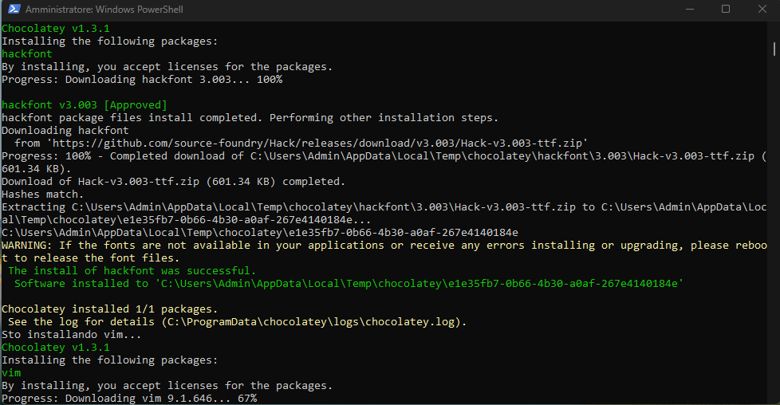

# PowerShell script per la configurazione degli strumenti di analisi

L'idea dello script è di configurare un ambiente di analisi installando automaticamente una serie di strumenti utili. È attualmente in fase di test.

## Esecuzione dello script

Lo script deve essere eseguito come amministratore. 

Navigare nella directory che contiene lo script

```powershell
cd "C:\percorso\alla\cartella"
```

Disattivare temporaneamente le restrizioni eseguendo

```powershell
Set-ExecutionPolicy Unrestricted
```

Lanciare lo script

```powershell
.\tools.ps1
```


## Prerequisiti per Windows 7

Su Windows 7 sono necessari aggiornamenti, poiché PowerShell 2.0 è molto vecchia e obsoleta. È richiesto almeno il .NET Framework 4.8, che necessita di un certificato firmato aggiuntivo. Testerò e migliorerò questa procedura più avanti, e la documenterò qui.

## Punti Ancora da Completare

- Aggiungere i sample dei malware in automatico.
- Gestire eventuali "crack della nonna". Da valutare, potrebbero creare rumore durante le analisi. (Evitare di aggiungere codici seriali veri poiché i malware potrebbero sniffarli).
- Aggiungere istruzioni per disattivare la telemetria.
- Creare uno script separato per gestire gli aggiornamenti mancanti su Windows 7 (PowerShell 2.0 non è adatta per Chocolatey e Boxstarter, non usa TLS di default).

## Note aggiuntive

L'idea è di creare uno snapshot della VM, lasciarla come base (al massimo aggiornare i tool regolarmente in base alle esigenze). Analizzare i malware sugli snapshot successivi, in caso di problemi tornare alla VM principale e ri-snapshottare da lì.

Esempio di una VM Windows 10


